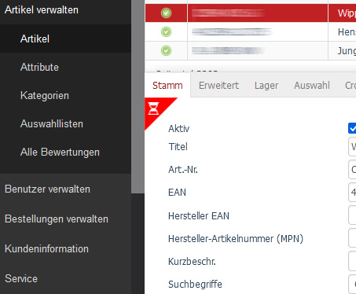

# Admin Ladeindikator für OXID eShop

Abhängig vom Shop dauert es im Adminbereich einen Moment, bis die gewünschte Tabansicht eines Objektes (z.B. einer Bestellung) geladen ist. Wenn dies länger dauert, bearbeitet man eventuell die bisherige Auswahl. Um dies zu vermeiden, fügt dieses Patch beim Eintragswechsel und auch beim Tabwechsel einen kleinen Ladehinweis hinzu, der erst wieder verschwindet, wenn die Seite komplett aktualisiert wurde.



## Installation

Auf der Konsole im Shoproot (oberhalb von source und vendor) folgende Befehle ausführen:

```bash
php composer require cweagans/composer-patches

php composer config extra.enable-patching true
``` 

Diesen Abschnitt bitte der composer.json (oder der verwendeten Patchdatei) hinzufügen bzw. ergänzen:

```
    "extra": {
      "patches": {
        "oxid-esales/oxideshop-ce": {
          "Admin Loading Indicator":
          "https://raw.githubusercontent.com/d3datadevelopment/oxid_patches/adminloadingindicator/10310_adminLoadingIndicator_6.1.patch"
        }
      }
    }
```

Es stehen folgende Patches für unterschiedliche Shopversionen bereit:

* OXID 6.1.x -> https://raw.githubusercontent.com/d3datadevelopment/oxid_patches/adminloadingindicator/10310_adminLoadingIndicator_6.1.patch
* ab OXID 6.2.x -> https://raw.githubusercontent.com/d3datadevelopment/oxid_patches/adminloadingindicator/10310_adminLoadingIndicator_6.3.patch

Passen Sie den Pfad an die von Ihnen eingesetzte Shopversion an.

Diesen Befehl ausführen:

```bash
php composer update --lock
``` 

Laden Sie den Adminbereich bitte komplett neu.

## Lizenz

Die vollständigen Copyright- und Lizenzinformationen entnehmen Sie bitte der [LICENSE](LICENSE.md)-Datei, die mit diesem Quellcode verteilt wurde.
